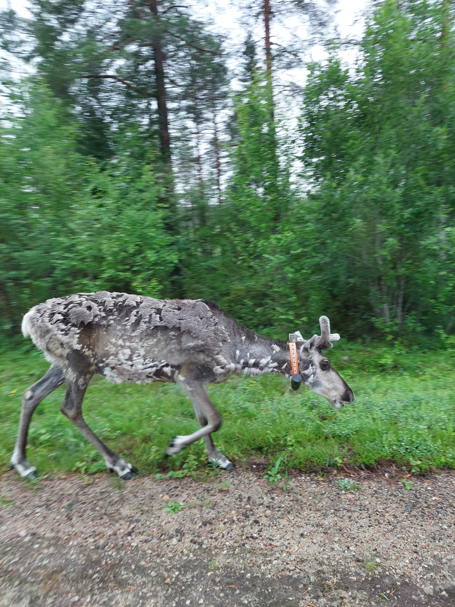
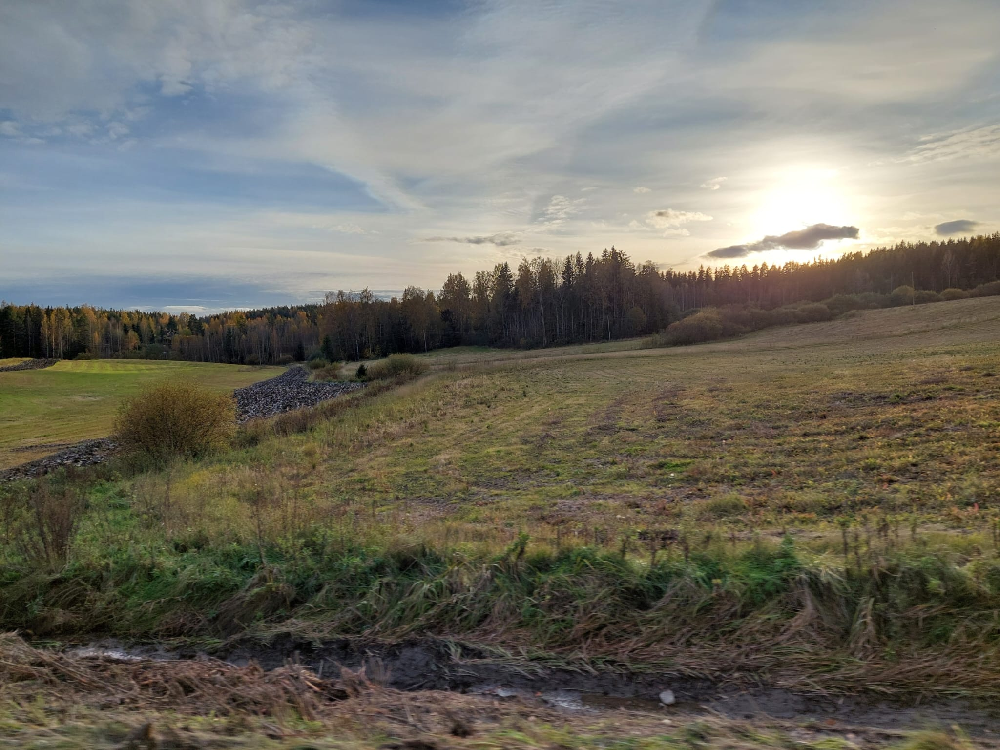
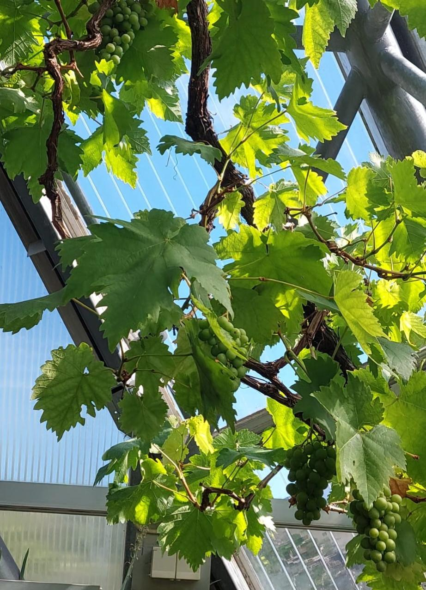

# My Travel Blog ✈️

Welcome to my travel blog! Here, I will share my travel experiences, tips, and adventures from all over Finland. 🌍

## Recent Posts

### Reindeer Strolling in Levi Forest  

### Golden Fields at Sunset in Ellivuori  

### Lush Green Vines at Oulu Botanical Garden  

## About Me

I’m an avid traveler with a deep love for discovering new destinations, immersing myself in diverse cultures, and trying unique foods. Join me as I share my adventures and experiences along the way! 🌍

## Favorite Destinations

Here are a few of my favorite travel destinations:
- **Helsinki** – I explore the dynamic mix of modern architecture, design, and seaside beauty that defines Finland’s vibrant capital.
- **Rovaniemi** – I embrace the magic of the Arctic, experiencing the Northern Lights and reindeer safaris in the heart of Lapland.
- **Turku** – I dive into Finland’s rich history, wandering its medieval streets, exploring Turku Castle, and sailing through the picturesque archipelago.

